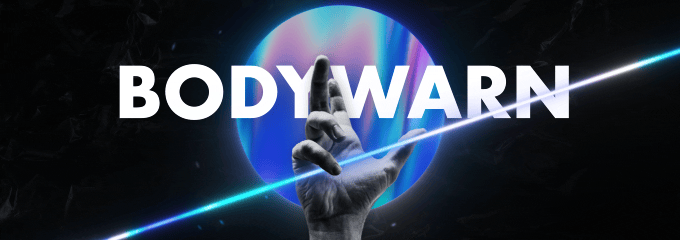

---

### Hey, I'm Bodywarn 👋

I'm a full-stack developer, designer, and student, working primarily in the web development scene.  
You can find my past projects and contact me on my [portfolio](https://bodywarn.netlify.app).

---

### 🌐 Socials
   
### 🛠️ Languages and Tools

#### Expert

### DESIGN

#### Proficient

#### Learning

#### Interested in learning

---

### 📊 Information

