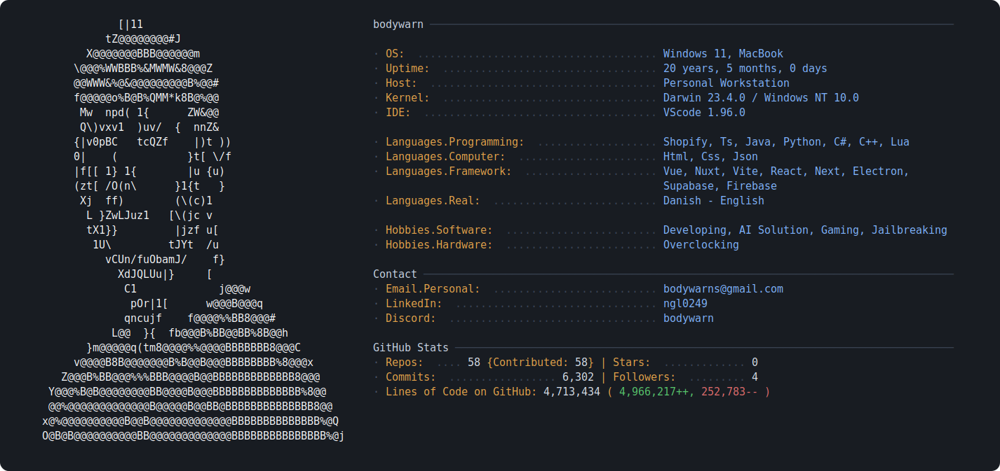

<picture>
  <source media="(prefers-color-scheme: dark)" srcset="images/dark_mode.svg">
  <source media="(prefers-color-scheme: light)" srcset="images/light_mode.svg">
  
</picture>

  <h1>Hey, I'm Bodywarn 👋</h1>

  

  
🔗 <a href="https://bodywarn.com">Check out my portfolio</a>

---

<picture>
  <source media="(prefers-color-scheme: dark)" srcset="images/github-snake-dark.svg">
  <source media="(prefers-color-scheme: light)" srcset="images/github-snake.svg">
  
</picture>
